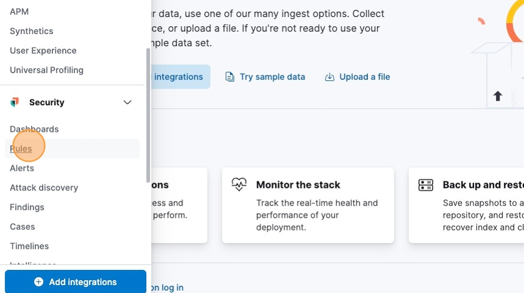
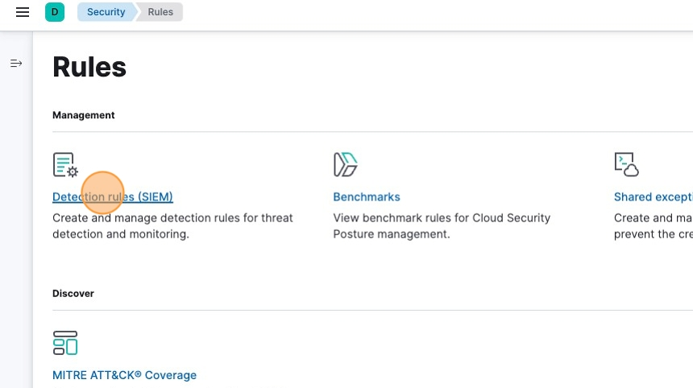
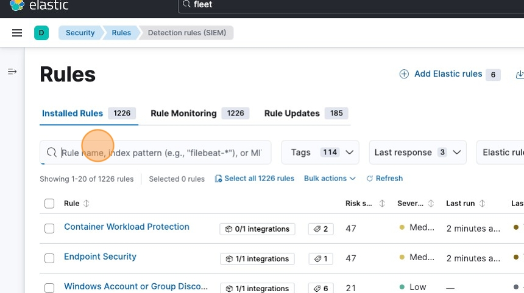
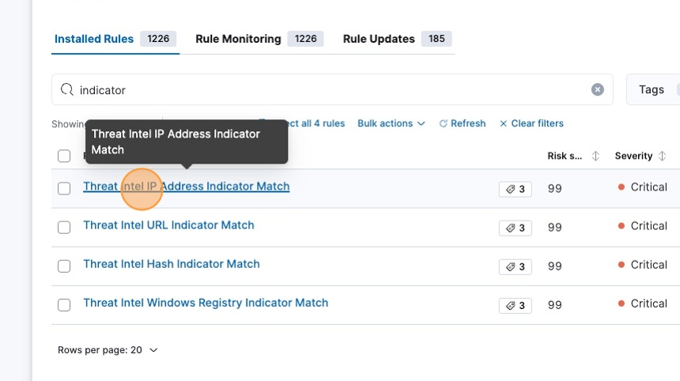
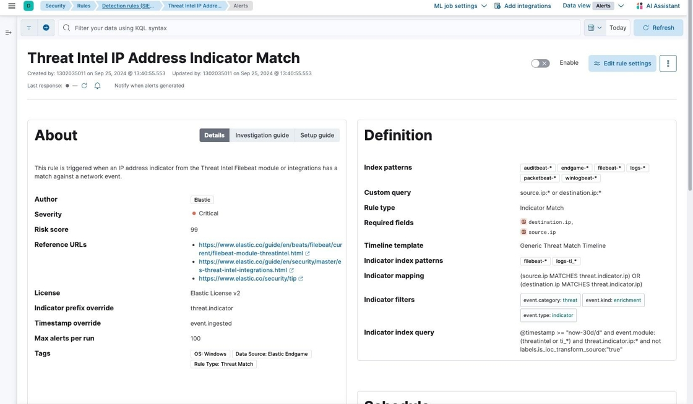

# OOTB Threat Intel Detection Rules

This guide provides essential instructions for utilizing out-of-the-box threat intelligence detection rules in Kibana, helping users effectively match incoming data against various threat intelligence feeds. By enabling these rules, users can enhance their cybersecurity posture by identifying potential threats associated with IP addresses, URLs, hashes, and more.

1\. Navigate to &lt;your_kibana_instance&gt;

2\. Click this menu icon.

3\. Click "Rules"

4\. Click "Detection rules (SIEM)"

5\. Click the "Rule name, index pattern (e.g., "filebeat-*"), or MITRE ATT&CK™ tactic or technique (e.g., "Defense Evasion" or "TA0005")" field.

6\. Type "indicator [[enter]]"

7\. Click "Threat Intel IP Address Indicator Match".\
\
Elastic includes out of the box rules to match incoming telemetry against threat intelligence feeds.  This includes matches against IP addresses, URL, hashes, and the Windows registry.

8\. The following rule definition is an example of an out of the box indicator match rule leveraging threat intelligence feeds, such as AbuseCH.

