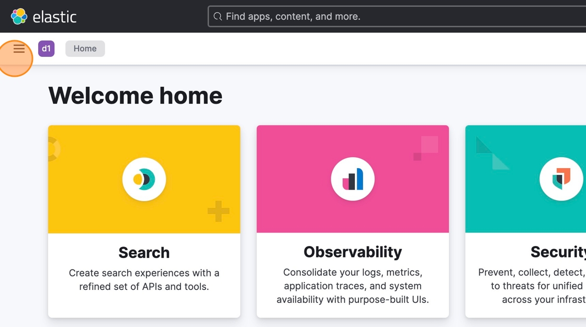
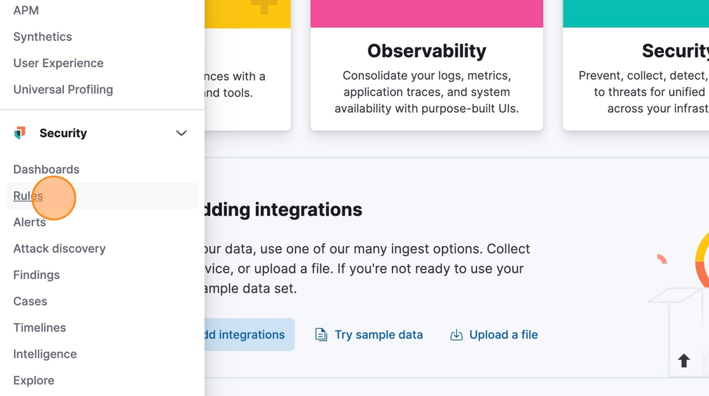
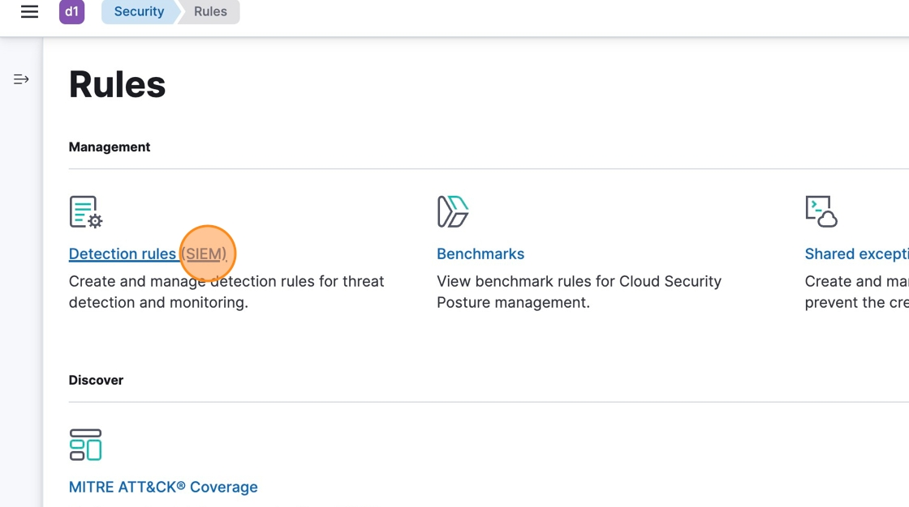
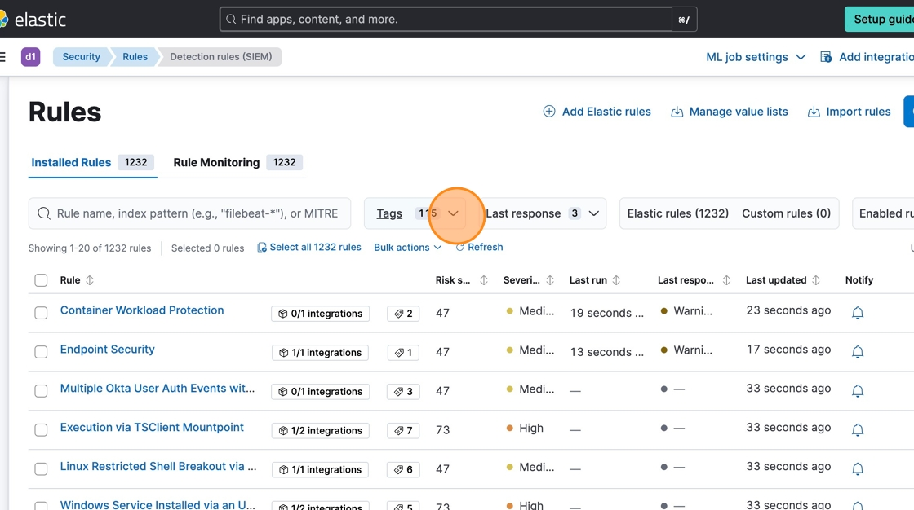
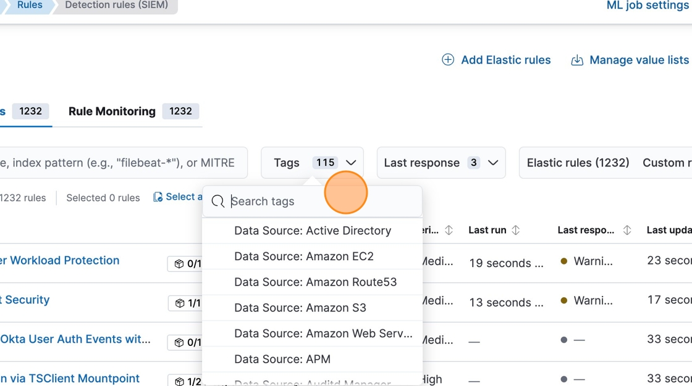
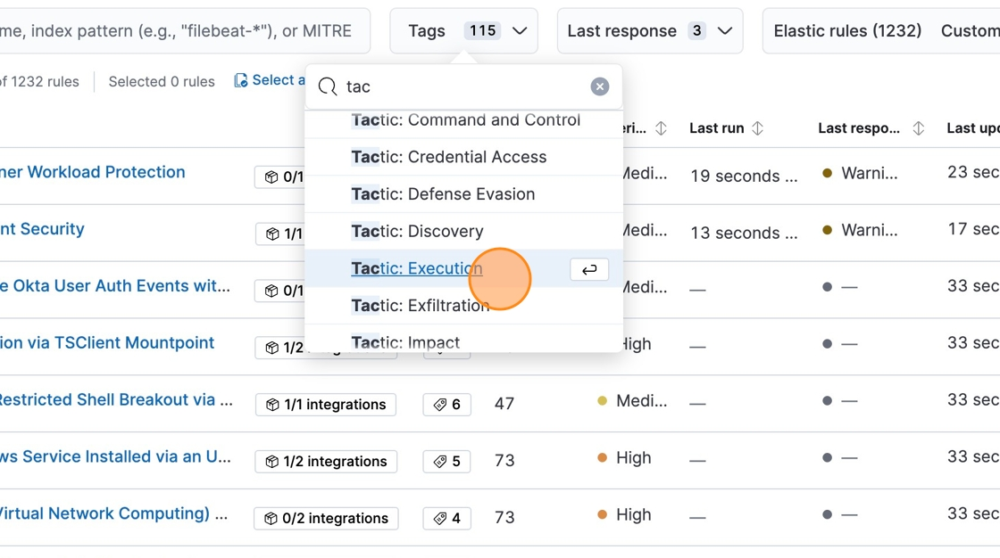
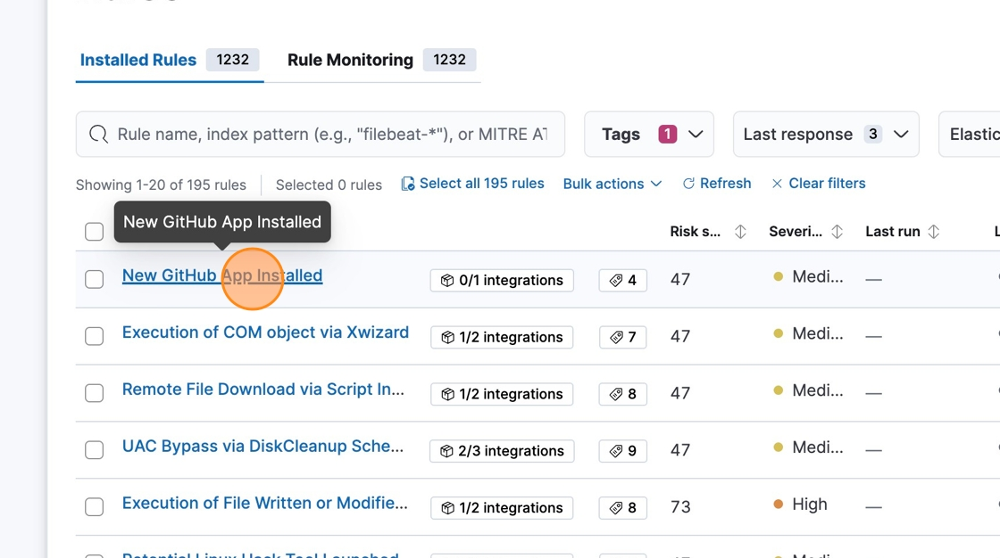
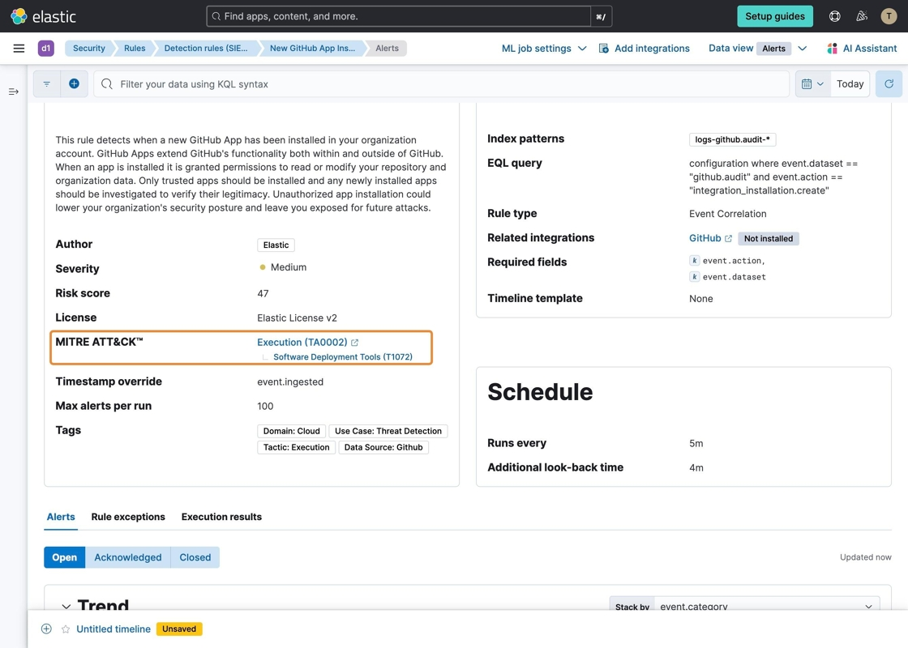

# SIEM Detection Rules - Mapping to MITRE ATT&CK

#### [Made by Tammy Torbert]

This guide is essential for anyone looking to enhance their security operations by utilizing SIEM detection rules in alignment with the MITRE ATT&CK framework. It provides a method to filter and identify relevant detection rules, ensuring that users can quickly access the necessary information to improve threat detection capabilities. By understanding the integration of ATT&CK tactics within SIEM rules, users can better tailor their security strategies to address specific threats.

1\. Navigate to &lt;your_kibana_instance&gt;.

2\. Click here.

3\. Click "Rules".

4\. Click "Detection rules (SIEM)".

5\. Click the down error icon on the "Tags" button.

6\. Click the "Search tags" field.

7\. Type "tactic"

8\. Click "Tactic: Execution" to select rules that match this MITRE ATT&CK tactic.  

Note: the various MITRE ATT&CK tactics are represented as tags within the out of the box detection rules.  Custom rules can also be tagged with MITRE ATT&CK tactics, techniques and subtechniques.

9\. In the filtered rule list, click "New GitHub App Installed".

10\. In the Rule overview, OOTB rules include the MITRE ATT&CK details associated to the detection rule.

