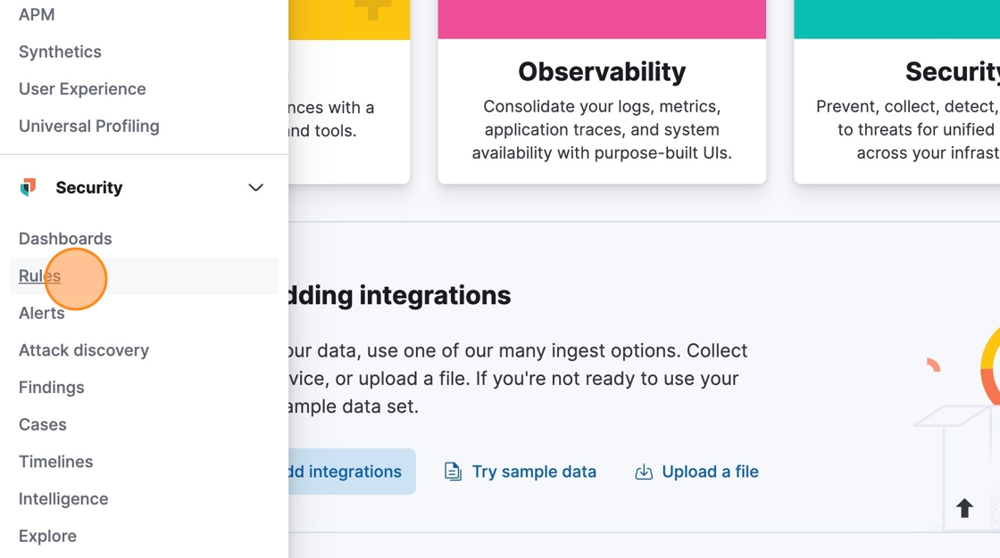
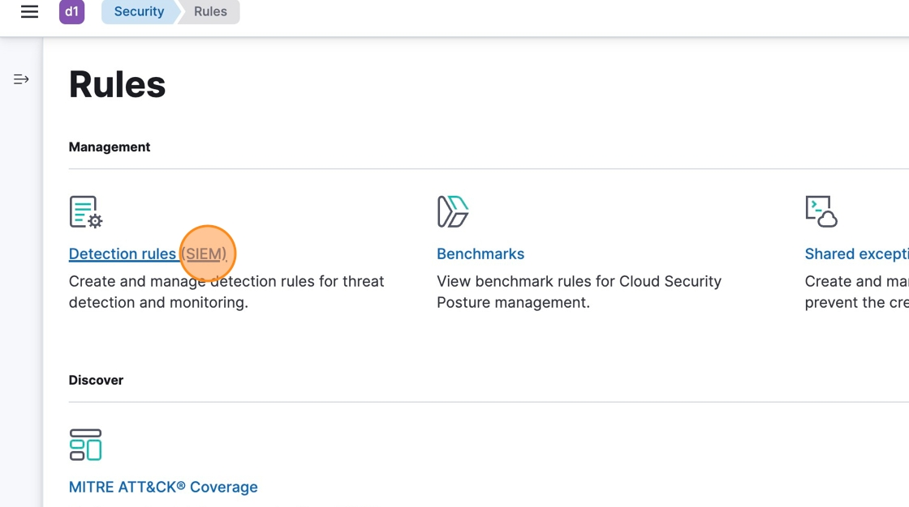
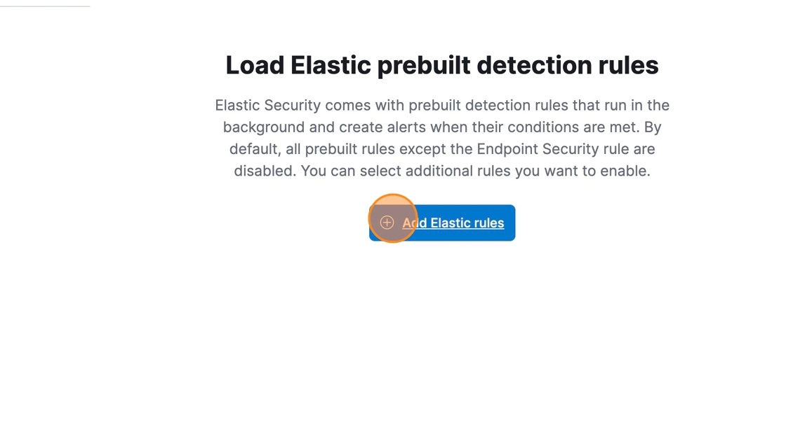
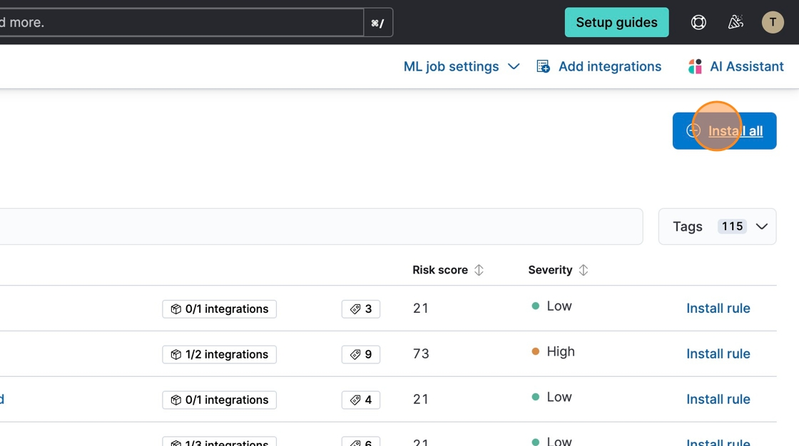
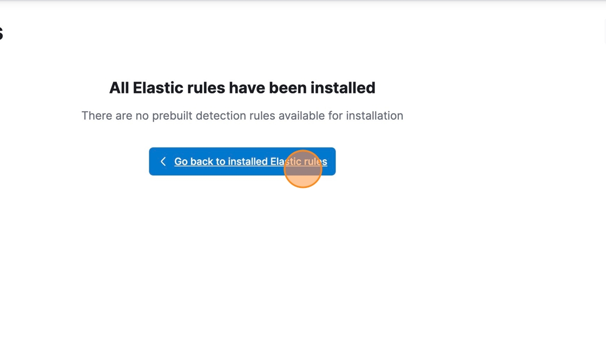
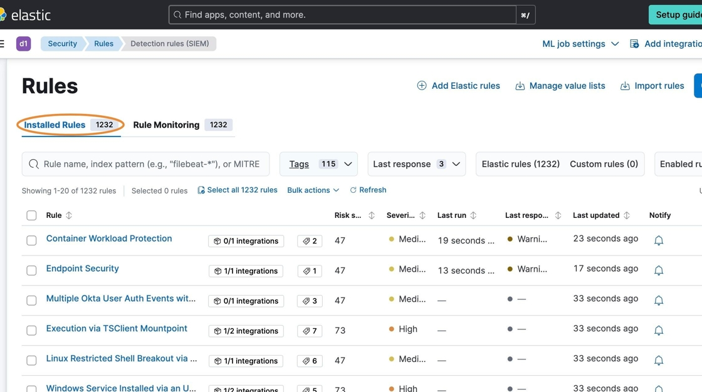

# Install Elastic SIEM Detection Rules

#### [Made by Tammy Torbert]

This guide provides a method for installing Elastic SIEM detection rules. By following the outlined steps, individuals can quickly set up essential rules that help in identifying potential threats within their systems. This streamlined process ensures that users can easily manage and utilize the powerful capabilities of Elastic SIEM.

1\. Navigate to &lt;your_kibana_instance&gt;.

2\. Click here.

3\. Click "Rules"

4\. Click "Detection rules (SIEM)"

5\. Click "Add Elastic rules".

6\. Click "Install all"

7\. Click "Go back to installed Elastic rules"

8\. After completing installation, the Installed Rules should reflect the total rules installed.

